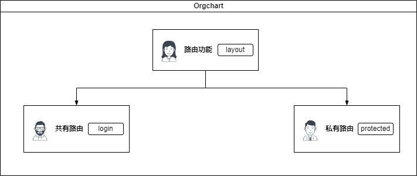

# 实现方案


> 共有一个共享模块layout,两个子路由模块：login和protected  
> 
```javascript
// 创建一个上下文
let AuthContext = React.createContext<AuthContextType>(null!);
```

```javascript
// 创建相应的状态管理组件
function AuthProvider({ children }: { children: React.ReactNode }) {
  let [user, setUser] = React.useState<any>(null);
  let signin = (newUser: string, callback: VoidFunction) => {
    return fakeAuthProvider.signin(() => {
      setUser(newUser);
      callback();
    });
  };
  
  let signout = (callback: VoidFunction) => {
    return fakeAuthProvider.signout(() => {
      setUser(null);
      callback();
    });
  };
  
  let value = { user, signin, signout };
  
  // 将数据提供给上下文
  return <AuthContext.Provider value={value}>{children}</AuthContext.Provider>;
}
```

```javascript
// 读取上下文的数据和相关的operation
function useAuth() {
  return React.useContext(AuthContext);
}
```

```javascript
// 该组件监听和响应认证的上下文数据
function AuthStatus() {
  let auth = useAuth();
  let navigate = useNavigate();

  if (!auth.user) {
    return <p>You are not logged in.</p>;
  }

  return (
    <p>
      Welcome {auth.user}!{" "}
      <button
        onClick={() => {
          // navigate 路由跳转
          auth.signout(() => navigate("/"));
        }}
      >
        Sign out
      </button>
    </p>
  );
}
```

```javascript

// 包裹需要认证的相关页面，否则就回到登陆页面
function RequireAuth({ children }: { children: JSX.Element }) {
  let auth = useAuth();
  let location = useLocation();

  if (!auth.user) {
    // Redirect them to the /login page, but save the current location they were
    // trying to go to when they were redirected. This allows us to send them
    // along to that page after they login, which is a nicer user experience
    // than dropping them off on the home page.
    // Navigate 页面重定向
    return <Navigate to="/login" state={{ from: location }} replace />;
  }

  return children;
}
```
```javascript
// 登录页逻辑
// 点击认证提交，开始登录之后页面进行跳转到proctected页面
// proctected页面的组件是由RequireAuth包裹的children
// 在RequireAuth中会做校验查看是否已经登录成功
function LoginPage() {
  let navigate = useNavigate();
  let location = useLocation();
  let auth = useAuth();

  let from = location.state?.from?.pathname || "/";
  function handleSubmit(event: React.FormEvent<HTMLFormElement>) {
    event.preventDefault();
    let formData = new FormData(event.currentTarget);
    let username = formData.get("username") as string;

    auth.signin(username, () => {
      // Send them back to the page they tried to visit when they were
      // redirected to the login page. Use { replace: true } so we don't create
      // another entry in the history stack for the login page.  This means that
      // when they get to the protected page and click the back button, they
      // won't end up back on the login page, which is also really nice for the
      // user experience.
      navigate(from, { replace: true });
    });
  }

  return (
    <div>
      <p>You must log in to view the page at {from}</p>

      <form onSubmit={handleSubmit}>
        <label>
          Username: <input name="username" type="text" />
        </label>{" "}
        <button type="submit">Login</button>
      </form>
    </div>
  );
}
```

# 最终效果
## 公共页

## 未登录

## 已经登录
